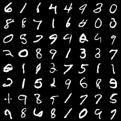
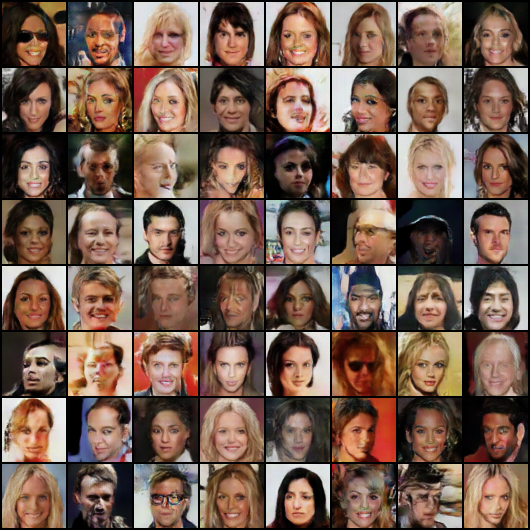
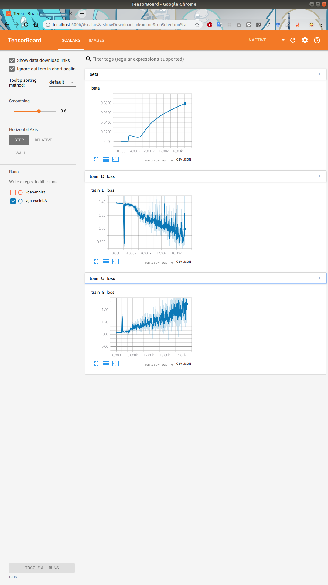

# vgan-pytorch

"Variational Discriminator Bottleneck: Improving Imitation Learning, Inverse RL, and GANs by Constraining Information Flow"

paper: https://arxiv.org/abs/1810.00821

## vgan-mnist

- 60,000 samples

- after 25epochs↓

## vgan-celebA

- about 200,000 samples

- after 25epochs↓

- learning curves↓

